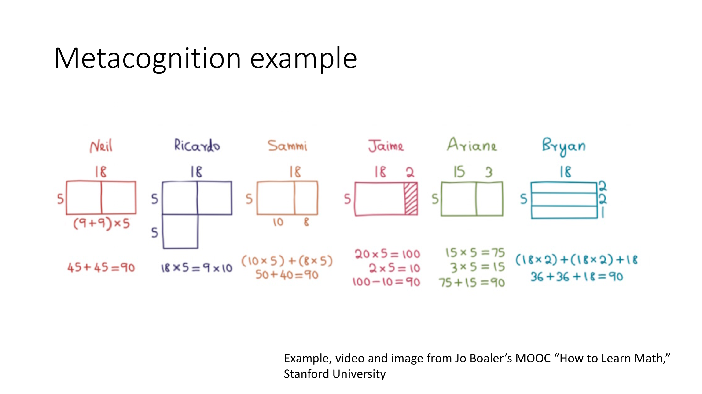
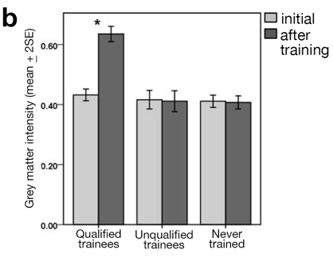

## page one
```{r, echo=FALSE}
#install.packages("vembedr")
library(htmltools)
library(vembedr)
library(shiny)
library(leaflet)
```

## two


## three
```{r, echo=FALSE}
embed_url("https://www.youtube.com/watch?time_continue=1&v=KUWn_TJTrnU")

```


## page 4

Cultivating a Growth Mindset


 
              
             
## Takeaways {.build}

### 1:	People are not born with the ability to perform tasks
### 2:	Your brain changes as you learn new tasks and as you practice
### 3: When we say we “just aren’t good” at something, we limit our own potential.


         
      
## 1:	People are not born with the ability to perform tasks

  Do you believe that people are born with the ability to juggle? 
That babies either have a 'juggler's brain' or they don't? That no amount of 
practice or learning can change your natural-born ability to catch and toss 
balls into the air?"

  Probably, you don't. Most people expect that those who can juggle have put in time and effort to learn how to do it.
                      
But many people believe that you are born either good or bad at math. When 
you hear someone say, ‘I’m just not good at it,’ they are demonstrating a 
‘fixed mindset.’ A fixed mindset suggests you are born with the potential to 
be good or bad at certain tasks and, thus, you have limited control over your 
ability to excel. People often have a fixed mindset when it comes to learning mathematics."
            
But having a fixed mindset limits your learning potential AND goes against what we know from studies in brain and learning science.
            


 
              
## 2:	Your brain changes as you learn new tasks and as you practice
                     
              
Your brain is plastic! Not plastic like Tupperware, but plastic in the sense that it is moldable, changeable, and flexible. When you take on difficult mental tasks, like learning math, your brain gets busy rewiring itself in a process that is analogous to the way your muscles build themselves up each time you work out."
             
  Much like strenthening your muscles, learning new skills can be difficult (and painful) at first, but your brain will adjust and it will get easier."
              
  Scholz et al. (2009) studied the brains of people learning to juggle (Figure 1 below). They found that the density of grey matter increased and the structure of white matter changed in those that learned to juggle, even after just a few weeks. People's brains were changing in response to new demands.


"Similarly, Woolett and Maguire (2011) examined the brains of people studying for the prospective cab drivers test in London. There, prospective cab drivers have to pass a tremendously demanding test of the crowded and complex road network. Woolett and Maguire found that people who studied for (and passed) the test had developed more grey matter in their posterior hippocampi, the brain region associated with spatial reasoning (Figure 2 below)."
               
##
### "Figure 2. 
####A) Street map of London. What a mess!  
```{r, echo=FALSE}
 m <- leaflet() %>%
        addTiles() %>%  # Add default OpenStreetMap map tiles
       # addMarkers(lng=174.768, lat=-36.852, popup="The birthplace of R") %>%
        addProviderTiles("providers$Stamen.Toner") %>%
      setView( -0.1278,51.5074, 12)
      m 
```

####B) Results before and after subjects studied for their test of London streets. Those that studied hard and qualified (qualified trainees) had an increase in gray matter density in their hippocampi, but those that gave up on the training (non-qualified trainees) or never trained (controls) did not see an increase in gray matter. Panel A is from openstreetmap.org; panel B is modified from Woollett and Maguire 2011.


With math, some people experience the ‘pain’ of doing new, difficult work and conclude that they don't have a gift for math. Unfortunately, parents and teachers may accidentally reinforce this message, saying things like ‘maybe math just isn’t your strength’ or ‘maybe math isn’t for you.’ But just as no one is born juggling, no one is born good at math."
              
           
## 3: When we say we “just aren’t good” at something, we limit our own potential."

The idea that you can increase your own brainpower through hard work is called a ‘growth mindset’. Someone with a growth mindset believes they can increase their ability through effort and practice. In contrast, someone with ‘fixed mindset’ believes they are inherently good or bad at certain tasks, and there is little to be done about it.
       
  Growth and fixed mindsets aren't simply ‘good’ and ‘bad’ attitudes, but instead reflect a person's ideas about how much they can improve.  A growth mindset is empowering because it reinforces a person's control over their own growth and learning. A fixed mindset can limit your potential, such that if you believe that no matter how hard you work, you won't get any better, you will almost certainly give up.
             
            
## Major takeaways:
              
              
### What can brain research teach us about you and your ability to learn mathematics?"
                      
### 1:	Expect learning to feel hard, especially at first"
                      
### 2:	Your brain will rewire itself to accommodate the increased demands"
                      
### 3: The only way to get better at math is to do more math"
                      


              
## References
Scholz J, Klein MC, Behrens T, Johansen-Berg H. 2009. Training 
                induces changes in white-matter architecture. Nature Neuroscience 
                12:1370-1371.
              
Woollett K, Maguire EA. 2011. Acquiring ‘the knowledge’ of London's 
                layout drives structural brain changes. Current Biology 21:2109-2114.
             